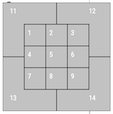

# ⚾ Comparing Baseball Player Statistics Using Visualizations

An analytical and visual comparison of two of Major League Baseball’s most powerful sluggers — **Aaron Judge** and **Giancarlo Stanton** — using Statcast data.

---

## 🚀 Project Overview

This project explores how data and visualization can illuminate the similarities and differences between **Aaron Judge** and **Giancarlo Stanton** — two of baseball’s biggest and hardest-hitting players.  

Standing **6'7" (2.01 m)** and weighing **282 pounds (128 kg)**, Judge is among the largest players in MLB history. Together with Stanton, he helped define an era of power hitting. In **2017**, Stanton led the league with **59 home runs**, followed by Judge with **52**, far ahead of the next-best total of **45**.  

Despite their shared dominance, their underlying performance patterns differ — and this project uses **Statcast** tracking data to find out how and why.

---

## ⚙️ About Statcast

**Statcast** is a state-of-the-art tracking system that uses **high-speed cameras** and **radar** to measure the precise location and motion of baseballs and players.  

Introduced to all **30 MLB ballparks in 2015**, Statcast has revolutionized the game — sparking a data analytics “arms race” as teams hire analysts to gain every possible edge in player evaluation and strategy.

---

## 📊 Dataset Information

This analysis uses Statcast data for both Aaron Judge and Giancarlo Stanton covering the **2015–2017 seasons**.  
Each row represents a single pitch thrown to the player.

### 🧾 Datasets
- **`judge.csv`** → Statcast data for Aaron Judge  
- **`stanton.csv`** → Statcast data for Giancarlo Stanton  

### 📈 Key Variables
- **Pitch-level:** `pitch_type`, `release_speed`, `spin_rate`, `zone`  
- **Batted ball:** `launch_speed`, `launch_angle`, `hit_distance_sc`  
- **Outcome:** `events` (single, double, home_run, etc.), `description`, `player_name`

---

## 🛠️ Technical Implementation

| Technology       | Purpose                            |
|------------------|------------------------------------|
| Python 🐍         | Core programming language          |
| pandas 🧮         | Data wrangling and manipulation    |
| matplotlib 📊     | Data visualization and plotting    |
| seaborn 🎨        | Statistical and comparative charts |
| Jupyter Notebook 📘 | Interactive development environment |

---

## 🎨 Custom Visualization Functions

Two helper functions are used to map Statcast strike zone data into **Cartesian coordinates**, enabling zone-based heatmaps and scatter plots.

- `assign_x_coord()` → Assigns x-coordinate values for Statcast zones  
- `assign_y_coord()` → Assigns y-coordinate values for Statcast zones  

These functions allow accurate visualization of home run strike zones.



---

## 🔍 Summary of Analysis Steps

1. **Filtered Data for 2017** — Selected only pitches from the 2017 season.  
2. **Filtered for Home Runs** — Isolated home run events for both players.  
3. **Created Visualizations** — Generated KDE plots and boxplots comparing launch speed, angle, and pitch velocity.  
4. **Focused on Strike Zones** — Limited data to pitches within the main strike zone (zones ≤ 9).  
5. **Mapped Strike Zone Coordinates** — Applied custom functions to assign Cartesian coordinates.  
6. **Generated 2D Histograms** — Visualized home run density within the strike zone for both players.

---

## 📁 Project Structure

```
Compare-Baseball-Player-Statistics-using-Visualizations
├── README.md
├── Compare_Baseball_Player_Statistics_using_Visualizations.ipynb
├── judge.csv
├── stanton.csv
└── zone.png
```

---

✅ **In summary:**  
This project combines **data wrangling**, **statistical visualization**, and **spatial mapping** to compare two of baseball’s most dominant hitters — revealing how raw power, pitch selection, and contact zones shape elite-level performance.
